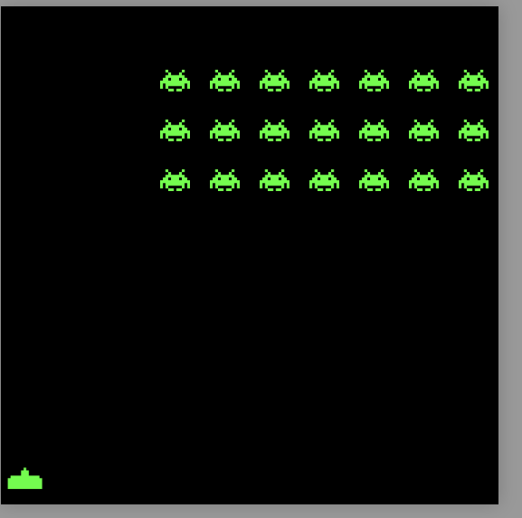
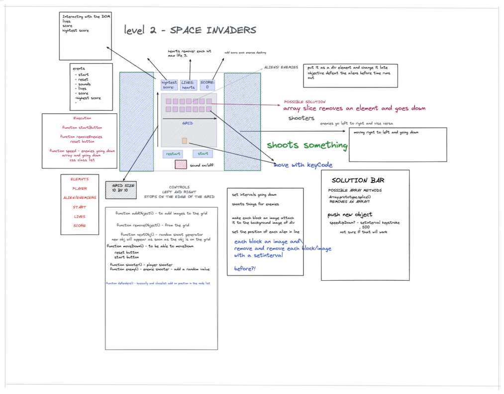
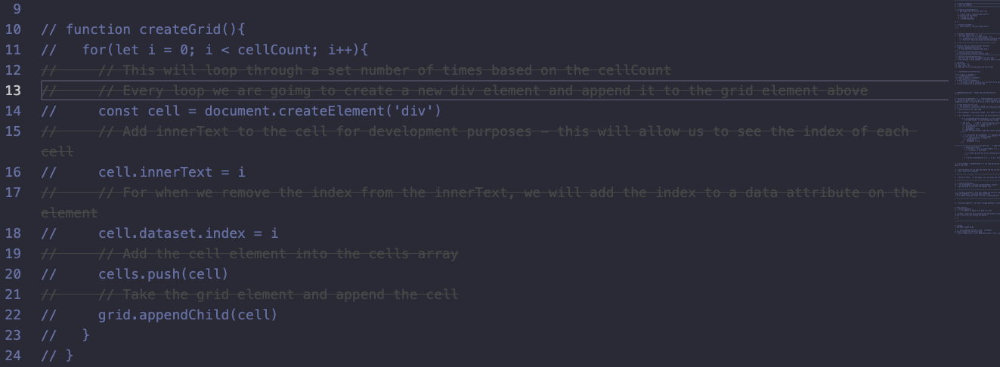
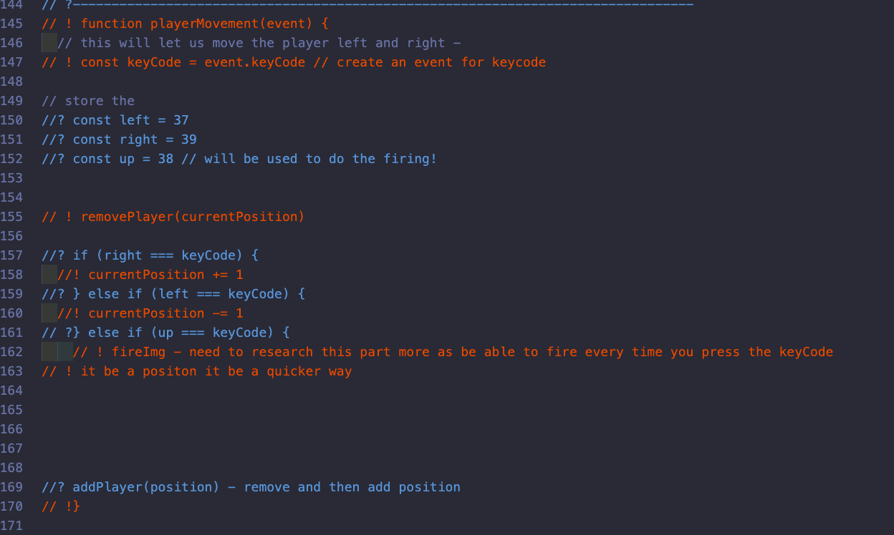
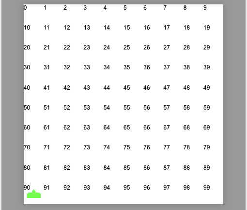
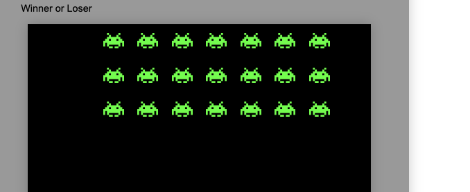

# Project One  - Space-Invaders

My first dev project for the Software Engineering Immersive course and also my first ever project using JavaScript.



## Deployment

Play SpaceInvader here: https://serhanmiah.github.io/Serhan-SpaceInvader/

## Getting started

1. Access the source code via the 'Clone or download' button 
2. Open the index.html file in your browser of choice to start the game.


## Goal and timeframe:
To build a functioning browser game with pure JavaScript in 8 days.


## Project Brief

This 7-day project required Vanila JS and CSS to complete a classic game. Having studied JavaScript with GA, I used this to programme a version of Space Invadedrs. This features a moveable player with functions to shoot upward. I set clear intervals: a scoreboard, and Aliens which moved down a grid. 


## Technologies used:
* Audio element for my background music and sound effects.
* Favicon to display in the browser tab.
* CSS Animation
* Position and absolute
* JavaScript(ES6)
* GitHub


## Game Brief:
* Render a grid-based game in the browser
* Create a one-player game against the computer
* The computer must be able to randomly place its pieces at the start of the game
* Design logic for winning and losing and display this on the screen
* Include separate HTML, CSS and JavaScript files
* Deploy your game online


## The Approach Taken and TimeLine: 

### Day 1 – Pseudocode and basic structures 
This was my first project with GA. I began with a quick design using Excalidraw, inputting the key element, execution, and events required to make the game.  





I blocked this out as a visual guide on what the game will look like. On the first day, my main aim was to have the instructional team leader check me off. I did no coding and stuck to pseudo coding for the project. The Key Elements of the game – Moving the player left and right. Moving the Space invaders left and right and getting the shooter with the KeyCode UP. 


The above is the design I settled on. This served as a guide of what I needed to accomplish by the end of the project. 


### Starting with pseudo coding: 







### Day 2 – Div creation and blocking the character’s movement 


On day two, I created a variable to hold the position of the player, and coded two functions which assigned character movement. Both functions hold keystrokes of left and right which will stop if the grid is greater than or equal to the length of the grid. These were made inside Event Listener. 


### Day 3 - Creating the space invaders movement 

By day three, the block of the game was completed. It was time to start the aliens. I began with the movement as a global variable, intending them to move: RIGHT, DOWN and LEFT, DOWN. This would loop toward the end of the grid. I also created a function so that the player can add one cell allowing the alien to move on grid space at a time. I did this by using a Boolean operative so that the player moving right would be true, and moving left would be a negative value. 

### Day 4 - Creating the shooting mechanic and clearing the intervals

On the fourth day, create a shooter function mechanic so that the player can press the up button and the laser will go up the grid, hitting the end of the grid. Creating a global variable that will hold the position of the player. Once I had the position of the player stored. I created this by creating two functions, one to hold the key event so that it will hold the keycode up and another so that the missile will fire up the grid. 


### Day 5 – Get the shooter to destroy the space invader

By day five, I needed to create a function which would get the laser to destroy the alien. The function I created was called “missile.” Within this function was another function called “move missile”, which I turned into a key event. This was, the laser would be fired once the UP button was pressed and the alien would be destroyed.

### Day 6 – Add the buttons, Start, reset and music to the game and more design 

On day six, I added the button elements: Start, Reset, Music. Additionally, I included the ability to turn music on and off within the game. This was achieved by adding a HTML audio element in the main file, where I added the sounds I wanted. CSS animation and keystrokes happen when the player shoots and the aliens are destroyed. 

# Featured Code:

HTML div element: I created a div element which holds the grid cells, including width and height of the cell. Below is the grid I created. This also required using CSS, which allowed me to incorporate size, colour, and height. 

```HTML
    //HTML GRID DIV ---------------------------------------------

      <div class="grid-wrapper">
        <div class="grid">
          <!-- Grid cells go here -->
        </div>
      </div>
```

```Javascript
  const width = 10
  const cellCount = width * width // the amount of the cells
  const cells = [] // cells as a grid - individual 
  const grid = document.querySelector('.grid')
  // ! -----------Grid ----------------

  function createGrid() {
    for (let i = 0; i < cellCount; i++) {
      const cell = document.createElement('div')
      cells.push(cell)
      grid.appendChild(cell)
    }
  }
```

```CSS
.grid {
  align-items: center;
  box-shadow: 0 0 20px 0 rgba(0, 0, 0, 0.2);
  display: flex;
  background-color: black;
  flex-wrap: wrap;
  height: 100%;
  justify-content: center;
  height: 550px;
  width: 550px;
  /* ! the size of the grid */
}

.grid div {
  /* border: 1px solid lightgrey; */
  flex-grow: 1;
  height: 10%;
  width: 10%;
  /* ! value of the grid */

}
```
For this project, we will be using JavaScript and CSS to create the grid. So creating a function called createGrid() will hold the cell from the div element. Once the CSS was completed, the createGrid function was done by using a loop to wrap and push the cell so what was created was shown below and in the browser. 





## Moving the player, left and right

So creating a global variable to hold the player location, for this project I chose the array grid 90. When the game starts, the player will be positioned at grid 90, shown below as a variable. 

```javascript
    //PLAYER POSITION ---------------------------------------------
let playerLocation = 90
```


Creating the function for left and right and setting the event keyCode to access the player. Using key code events to store the movement and then applying a function playerRight and playerLeft which is shown below.

```javascript
    //PLAYER MOVEMENT ---------------------------------------------

 function playerLeft() {
    removePlayer(playerLocation)
    if (playerLocation % width !== 0) {
      playerLocation -= 1
    }
    player(playerLocation)
  }

  function playerRight() {
    removePlayer(playerLocation)
    if (playerLocation % width < width - 1) {
      playerLocation += 1
    }
    player(playerLocation)
  }
```
Extra resources – 

https://www.toptal.com/developers/keycode/table-of-all-keycodes

list all the keyCode 

```javascript
    //PLAYER MOVEMENT ---------------------------------------------

  document.addEventListener('keydown', function playerMovement(event) {
    if (event.keyCode === 39) {
      playerRight()
      // // STOPS AT THE LEFT EDGE
    } else if (event.keyCode === 37) {
      playerLeft()
      // STOPS AT THE LEFT EDGE
    }
  })
```


After getting the movement done, using an addEventListener on key-down the function will hold an event. If the player presses the keyCode 39 it will move Right and if the player presses button 37 it will go left. 


### Creating the Alien/Space Invaders and adding the movement 

This was a basic concept on how to move the alien Left and Right using the knowledge I have gained in the player Movement. 

One of the trickiest parts of the project was to get the aliens/space invaders to pan across a screen and descend as swarms, preventing them from reaching the bottom of the screen.

I was able to assign numbers from the grid to become the alien invaders. The number I have chosen from using the array method to hold the position of each alien. From 1, 2, 3, 4, 5, 6, 7, 11, 12, 13, 14, 15, 16, 17, 21, 22, 23, 24, 25, 26, 27 inside the grid will hold the aliens. Since I needed to loop all the selected numbers I used a for loop to select the numbers and add them with a classList using a combination of DOM elements and CSS. Using CSS and a class to have the background image of the space invade fixed so it will be displayed on the grid. 

```javascript
    //SPACESHIP POSITION ---------------------------------------------

 function startGame() { // Done Start Button
    alienArray = [1, 2, 3, 4, 5, 6, 7, 11, 12, 13, 14, 15, 16, 17, 21, 22, 23, 24, 25, 26, 27]
    alienArrayPosition = Array.from(alienArray)
    alienInvaderDestoryed = []

    clearInterval(invadersId)
    removeInvaders()
    removePlayer()
    score = 0
    scoreDisplay.innerHTML = score

    invadersId = setInterval(() => {
      player() // add player
      moveInvader()
    }, 1000)
```





Tracking the Alien movement was challenging. I needed the Alien to move across the grid to the right and then down and then to the left. To do this I created a variable that will hold the value of one. This is so that I can add to the value. So if the Characters move right we will need to add 1 to the value. Since this was a value I can decrease the value.

The code is shown below on how the movement of the grid. 

```CSS
    //SPACESHIP CSS ---------------------------------------------
.invader {
  background-image: url(../assets/spaceinvader_image.png);
  background-size: 60%;
  background-position: center;
  background-repeat: no-repeat;
}
```
The code is shown below on how the movement of the grid. 
```javascript
    //SPACESHIP MOVEMENT ---------------------------------------------

    function moveInvader() {

    const leftInvader = alienArray[0] % width === 0
    const rightInvader = alienArray[alienArray.length - 1] % width === width - 1

    removeInvaders() // first step remove the invader! 

    // ! right side
    if (rightInvader && rightSide) {
      for (let i = 0; i < alienArray.length; i++) {
        alienArray[i] += width + 1
        invaderMovement = -1
        rightSide = false
      }
    }
    // ! left side of the grid
    if (leftInvader && !rightSide) { // booolean operative either right or left 
      for (let j = 0; j < alienArray.length; j++) {
        alienArray[j] += width - 1
        invaderMovement = 1
        rightSide = true
      }
    }

    // ! then looping it again to go with the direction of the invader movement with 

    for (let i = 0; i < alienArray.length; i++) {
      alienArray[i] += invaderMovement
    }

    spaceInvaders()

    if (cells[laserPosition].classList.contains('invader', 'laser')) {
      cells[laserPosition].classList.add('destruction')
      cells[laserPosition].classList.remove('laser')
      clearInterval(invadersId)
    }

    // !losing condition 
    for (let index = 0; index < alienArray.length; index++) {
      if (alienArray[index] >= (cells.length - (width - 1))) {
        whoWins.innerHTML = 'LOSER! Game OVER'
        // console.log('game over')
        clearInterval(invadersId)
      }
    }
  }
```

Setting a setInterval so that the aliens will move automatically. I found the set interval quite challenging. I had a time when the alien was going off the grid. 


### Firing the Gun and destroying the space invaders.

For this part, I had to use CSS and JS. I had to add a class .laser in the CSS file to hold the image of the laser and its content. Including its size and position. 

```CSS
    //SPACESHIP LASER CSS ---------------------------------------------
.laser {
  background-image: url(../assets/Red_laser-ConvertImage_votu8o.png);
  background-size: 30%;
  background-position: center;
  background-repeat: no-repeat;
}
```

I also need to track the position of the laser. I needed the position to be the same as the player's location and use a let variable so that it can be changeable according to the player's movement. So first was to move the laser upwards. Creating a new function called missiles which will hold an event. Adding the missiles and removing the missiles come in two different parts. As a local variable, we hold the laser position to be equal to the player location and have a laser Id to store the intervals. 

```javascript
    // PLAYER KEYCODE MISSLE MOVEMENT ---------------------------------------------
    let laserPosition = playerLocation // laser position 
    let laserID // clear the invterval 
    // let testInterval
```

The next part inside the function of the missile is to create a new function called moveMissle. 

Create a classList.remove inside the moveMissile function. 

```javascript
    // PLAYER KEYCODE MISSLE MOVEMENT ---------------------------------------------
    function moveMissile() {

      cells[laserPosition].classList.remove('laser')
```

By creating an if-else statement to move the laser based on the width of the grid and laser position. if the laser position is greater or equal to the width within the if statement then the laser position will be minus or equal to the width and the laser will be added. 

Since I was using a setInterval the laserID was created to clear the interval so that it would not allow the laser to keep going past the grid.


```javascript
    // LASER POSITION SETINTERVAL MISSLE MOVEMENT ---------------------------------------------
      if (laserPosition >= width) {
        laserPosition -= width
        cells[laserPosition].classList.add('laser')
      } else {

        clearInterval(laserID)
      }
```

The player can shoot. The next was to create a series of sequences when the player hits the alien invaders. Below is the code explaining how I got the player to remove the alien and add the destruction sequence. 

```javascript
    // PLAYER KEYCODE MISSLE MOVEMENT ---------------------------------------------
      if (cells[laserPosition].classList.contains('invader')) {
        cells[laserPosition].classList.remove('laser')
        cells[laserPosition].classList.remove('invader')
        cells[laserPosition].classList.add('destruction')

        setTimeout(() => cells[laserPosition].classList.remove('destruction'), 500)
        explosion.play()


        clearTimeout(laserID)

        const alienGone = alienArray.indexOf(laserPosition)
        alienInvaderDestoryed.push(alienGone)
        if (alienInvaderDestoryed.length === alienArray.length) {
          whoWins.style.color = 'red'
          whoWins.innerHTML = 'YOU WIN'
          clearInterval(invadersId)
        }
        hitPoints()

      }
    }
```

This was so that if the laser position contains the invader it will remove the laser and invader. After the invader and laser is removed add a fourth property to add the destruction. I was able to add a timeout inside the if statement so that with 500 milliseconds the destruction property will be added. 

The last section is to add the keyCode event up. As I listed the missile function as a key event to complete the missile function as it would be an eventlistener. 

```javascript
    // PLAYER KEYCODE MISSLE MOVEMENT ---------------------------------------------

     if (e.keyCode === 38) {

      laserID = setInterval(moveMissile, 100)
      // ! shooter sound effects effects 

      shooterSound.play()
    }
    }
```


## Bugs
* There are some obvious bugs I would like to address by making the aliens shoot down and seeing how this app will be made in React for future development.

### Challenges
This was my first project using JavaScript so I faced many challenges, of which the biggest were:
* Moving the space invaders left and right and then going back towards the end of the game. I have explained how I got the aliens moving.  
* Getting the right sound effect was a combination of HTML, CSS and JS as I had to use audio Element and use a function that will call the soundtrack. 
* Making the obstacles move at a higher speed after each round.

### Win
* Getting the player moving left or right while having the ability to shoot upwards. I struggled with the clear interval. But found a solution using a local variable and if statement
* Getting the invaders moving left to right and down the grid. This took a while but I have explained it above. 


## Future improvements:
* Make it more presentable, caught covid during the first project week and was unable to work 100% on the task. .
* Get the space invader to shoot 
* Get a high score using local storage.

## Key learnings
Making my first static JS browser game from scratch was a great learning exercise and a fun way to consolidate my learnings. In particular, I learnt a lot about DOM manipulation, different use cases for different JS array methods, and working with setintervals.
